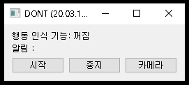
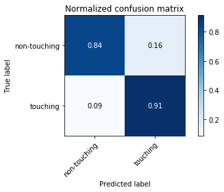

<p align="center"></p>

<br>

# DO Not Touch your face (DONT)

* DONT(R) was developed to overcome 2019 pandemic of SARS-CoV-2 in the world by MI2RL@Asan Medical Center, South Korea  

* Pretrained network is available (weights folder)  

* Video demo  : https://youtu.be/l4uRJzF222o

<br>

## NEWS (20.03.11) : ver.0.2 release !

* Boost up accuracy of action recognition  

* Fixed minor bugs    

* TO DO:

  * Release .exe, .deb file with manual

  * Release English version

    

<br>

## Installation

```bash
# Clone this repository
$ git clone https://github.com/mi2rl/DONT.git

# Make virtual environment
$ conda create -n [your virtual environment name] python3

# Activate virtual environment
$ conda activate fta_gpu

# Install requirements
$ pip install torch==1.2.0+cu92 torchvision==0.4.0+cu92 -f https://download.pytorch.org/whl/torch_stable.html

$ pip install -r requirements.txt
```

  <br>


## Quick Guide

* GUI program can be run using

  ```bash
  $ python main.py
  ```


* GUI Window  

  <p align="center"></p><br>  
* Run/pause the classifier by '시작'/'중지' button
  
  * Action classifier's result will be shown 
  
* Change configuration by '설정' button (To be updated)
* View web-cam image by '카메라' button   

<br>


## Further details

* **Rationale**
    * A Study Quantifying the Hand-to-Face Contact Rate and Its Potential Application to Predicting Respiratory Tract Infection (https://www.tandfonline.com/doi/full/10.1080/15459620802003896)
    * Controlling the novel A (H1N1) influenza virus: don't touch your face! (https://www.journalofhospitalinfection.com/article/S0195-6701(09)00255-2/abstract)
    * Hand Hygiene Practices in a Neonatal Intensive Care Unit: A Multimodal Intervention and Impact on Nosocomial Infection (https://pediatrics.aappublications.org/content/114/5/e565.short)  
      


* **Datasets**
  
    * To make training data, [MI2RL](https://www.mi2rl.co/) researchers and professors obtain a total of 190,000 images
    * Recording at approximately 10 different locations  
    * Action classes : 11 classes 
      * Overall classes : drinking, picking up phone, removing mask, resting chin on hand, rubbing eyes, touching glasses, touching hairs, touching keyboard, touching nose, touching phone, wearing mask
      * Touching classes : picking up phone, resting chin on hand, rubbing eyes, touching hairs, touching nose
        
    
* **Action Classification Network**
  * I3D Network (https://github.com/deepmind/kinetics-i3d)   
    * Additional settings
    * Training phase
        * The number of  frames in each stack for 3D CNN : 16
        * Data augmentation
          * Step in frames between each clip : 4
          * Color distortion
          * Rotation
          
      * Inference Phase
        * The number of  frames in each stack for 3D CNN : 24
          
  
* **H/W specification**

  * Test specification.
  
    
    * GPU : Geforce GTX 960 4GB
    * CPU : Intel(R) Core i7-6700 CPU 3.40GHz 
    * OS : Linux Ubuntu 18.04
    * Inference
    
      * 0.07~0.085 sec on GPU
      * 1.4~1.5 sec on CPU
      * CPU usage  ≈ 35%  
      * GPU memory usage ≈  1.1GB
        
    
  * Minimum specification
  
    
    * GPU : Geforce GTX 960 4GB
    * CPU : Intel(R) Core i7-6700 CPU 3.40GHz 
    * OS : Linux / Windows  
      

<br>

## Experiment Results

**Confusion matrix : binary-class**
<br>

<p align="center"></p><br>
## Contact for Data Donation 

* For improving accuracy, we need more data from different environments. 
  If you can give your data, please send it to namkugkim@gmail.com. Your privacy will be protected.

