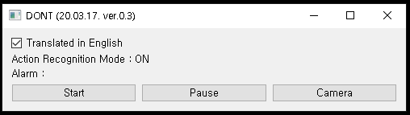
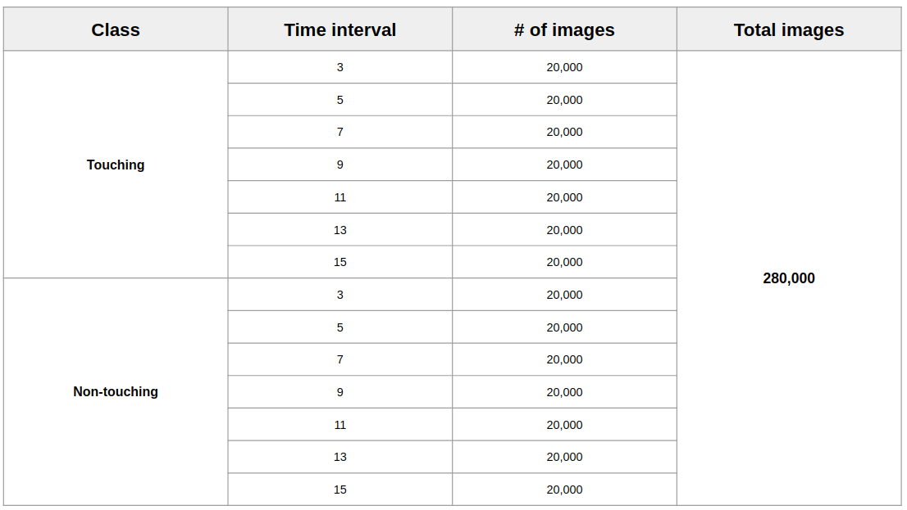
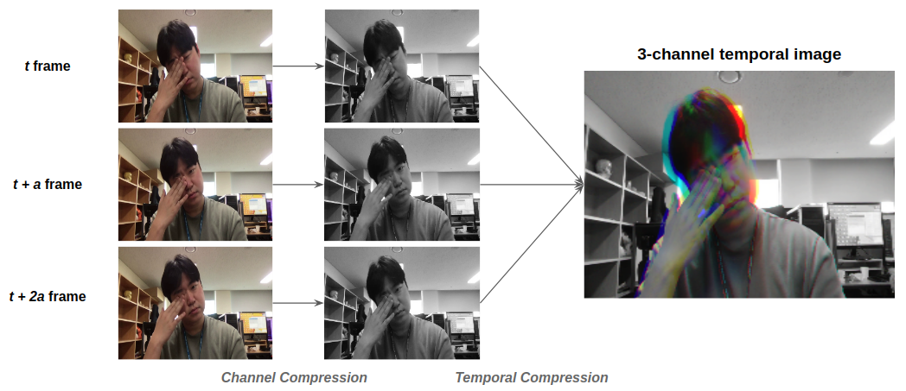

<div style="width:40px;height:30px;float:right;">
    <p align="right"><a href="https://github.com/mi2rl/DONT/blob/master/README_ENG.md"></a></p>
</div>
<div style="width:40px;height:30px;float:right;">
    <p align="right"><a href="https://github.com/mi2rl/DONT/blob/master/README.md"></a></p>
</div>

<p align="center"></p>
<br>

# DO Not Touch your face (DONT)

* Download link (executable file)  : https://www.dropbox.com/s/2rfqog5kxuq4hmw/dont-release.ver.0.3.zip?dl=0
* DONT(R) was developed to overcome 2019 pandemic of SARS-CoV-2 in the world by MI2RL@Asan Medical Center, South Korea
* Pre-trained network is available (weights folder)  
* Demo video  : https://youtu.be/Yn7jqsNAmNk

<br>


## NEWS (20.03.30) : DONT/WASH ver.0.4

* **Add MobileNet version.**
  * **Can recognize face-touching actions in 0.07 sec with Intel(R) Core i7-6700 CPU 3.40GHz or higher (92% accuracy)**
* TO DO:

  * Upload a paper on Arxiv about this project
  
  * Add sound effects for alarm
  
  * Add a "report" function based on 24-hour monitoring mode
  
  * Increase the supported languages (Eng, Jap) for GUI
  
  * Try video clips from ceiling-mounted security cameras
  
  * Develop a lightweight model for mobile phones, CPU-only machine

<br>

## Installation

```bash
# Clone this repository and enter it:
$ git clone https://github.com/mi2rl/DONT.git

# Set up the environment
$ conda create -n [your virtual environment name] python3

# Activate the environment
$ conda activate fta_gpu

# Install all the dependencies
$ pip install torch==1.2.0+cu92 torchvision==0.4.0+cu92 -f https://download.pytorch.org/whl/torch_stable.html

$ pip install -r requirements.txt
```

  <br>


## Quick Guide

* GUI program can be run using

  ```bash
  $ python main.py
  ```


* GUI

  <p align="center"></p><br>  
  * Run/pause the classifier by 'Start'/'Pause' button
    
    * The result from action classifier will be shown 
    
  * Turn on Webcam display in live using 'Camera' button   
  <br>
  
* Run Windows (EXE) App

  * Unzip a downloaded .zip file, then run "DONT.exe"

    <p align="center"></p><br>  

* When Webcam display window is activated, other buttons are deactivated 
  (Terminate Webcam display mode and press the buttons)

* **If the webcam is not ready, the software does NOT work properly.**

<br>


## Further details

* **Rationale**
    * A Study Quantifying the Hand-to-Face Contact Rate and Its Potential Application to Predicting Respiratory Tract Infection (https://www.tandfonline.com/doi/full/10.1080/15459620802003896)
    * Controlling the novel A (H1N1) influenza virus: don't touch your face! (https://www.journalofhospitalinfection.com/article/S0195-6701(09)00255-2/abstract)
    * Hand Hygiene Practices in a Neonatal Intensive Care Unit: A Multimodal Intervention and Impact on Nosocomial Infection (https://pediatrics.aappublications.org/content/114/5/e565.short)  
      


* **Datasets**
  
    * In order to make the training dataset, [MI2RL](https://www.mi2rl.co/) members and many collaborators contributed. As a result, we gathered a total of 190,000 images
    * Video clips were recorded at more than 10 different locations  
    * Action classes : 11 classes 
      * Overall classes : drinking, picking up phone, removing mask, resting chin on hand, rubbing eyes, touching glasses, touching hairs, touching keyboard, touching nose, touching phone, wearing mask
      * Touching actions : picking up phone, resting chin on hand, rubbing eyes, touching hairs, touching nose
        
    
* **Action Classification Network (I3D / MobileNet3)**
  
  * I3D Network (https://github.com/deepmind/kinetics-i3d)   
    * Training phase
        * The number of  frames in each stack for 3D CNN : 16
        * Data augmentation
          * Step in frames between each clip : 4
          * Color distortion
          * Rotation
        
    * Inference Phase
      * The number of  frames in each stack for 3D CNN : 24
    
  * MobileNet3 (https://github.com/d-li14/mobilenetv3.pytorch)
  
    * Training phase
  
      * The number of frames in each stack for CNN : 3
  
        * Make 3 channel image as following time interval (3, 5, 7, 9, 11, 13, 15)
  
        * Each time interval, we make 20,000 images. So, the number of training images are 280,000. 
  
          <br>
  
      * Datset configuration
  
        <br>
  
        <br>
  
      * Inference Phase
  
        * Time interval (stride): 3 frame
  
* **H/W specification**

    * Test specification.
      * GPU : Geforce GTX 960 4GB
        * CPU : Intel(R) Core i7-6700 CPU 3.40GHz 
        * OS : Linux Ubuntu 18.04
        * Inference 
        * I3D Network
          * 0.07~0.085 sec on GPU
            * 1.4~1.5 sec on CPU
            * CPU usage  ≈ 35%  
            * GPU memory usage ≈  1.1GB
          * MobileNet v3
            * 0.03~0.04 sec on GPU
            * 0.07~0.09 sec on CPU
            * CPU usage ≈ 4%
            * GPU memory usage ≈ 520MB
              
    * Minimum specification
      * Geforce GTX 960 4GB
      * Intel(R) Core i7-6700 CPU 3.40GHz
      * OS : Linux / Windows
    <br>

## Experimental Results

**Confusion matrix : binary-class**
<p align="center"></p><br>
<br>

## Limitations

* DONT began at 2020.03.05, and has been in the works for about few weeks. We decided that it would be more desirable to call for joint efforts through faster release than creating high-performance programs, so we decided to proceed with the disclosure despite the lack of progress.

<br>


## How to donate your data

* For more robust model for DONT, we need more data from different environments and people. 
  If you want to donate your data, please send it to namkugkim@gmail.com. Your privacy will be strictly protected, as strong as possible.
  <br>


### Guideline for data donation

* Please take a video and send it to the e-mail address above.
* Recording process is as follows.
  * Wearing mask -> (With a mask) -> Touching nose -> Resting chin on hand -> Rubbing eyes -> Touching hairs -> Drinking water-> Touching phone -> Picking up phone -> Touching keyboard -> (Without a mask) -> Touching nose -> Resting chin on hand -> Rubbing eyes -> Touching hairs -> Drinking water-> Touching phone -> Picking up phone -> Touching keyboard
  * Moderate video recording time is about 90 seconds.
  * Example : [Gudieline for video recording](https://youtu.be/NU5FlHp6Qgg)

<br>

## Project Contributors

* Artificial Neural Network and GUI development
  * Sungman Cho(dev.sungman@gmail.com), Minjee Kim(minjeekim00@gmail.com)
* Data acquisition and annotation
  * Dr. Joonmyeong Choi(jm5901@gmail.com), Taehyung Kim(kimtaehyeong62@gmail.com), Juyoung Park(godoctorsam@gmail.com)
* General Management: Prof. Namkug Kim(namkugkim@gmail.com)
* Data provider : 37 MI2RL researchers, Prof. Dong-woo Seo(Dept. of Emergency Medicine at AMC), Prof. Namkug Kim(Dept. of Radiology at AMC), Prof. Sunjin Lim(SNU Dental Hospital)
