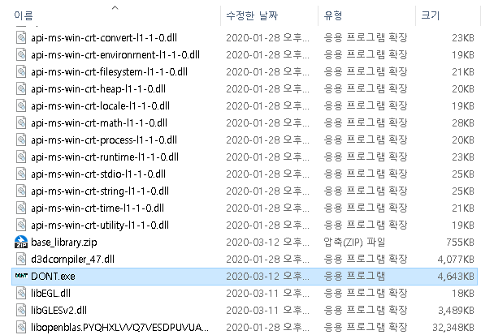

<div style="width:40px;height:30px;float:right;">
    <p align="right"><a href="https://github.com/mi2rl/DONT/blob/master/README_ENG.md"></a></p>
</div>
<div style="width:40px;height:30px;float:right;">
    <p align="right"><a href="https://github.com/mi2rl/DONT/blob/master/README.md"></a></p>
</div>

<p align="center"></p>
<br>

# DO Not Touch your face (DONT)

* Download link (executable file)  : https://www.dropbox.com/s/rhehe3lvq1wqbjv/dont-release.ver.0.2.1.zip?dl=0
* DONT(R) was developed to overcome 2019 pandemic of SARS-CoV-2 in the world by MI2RL@Asan Medical Center, South Korea
* Pre-trained network is available (weights folder)  
* Demo video  : https://youtu.be/Yn7jqsNAmNk
* Caution - This program works smoothly at a speed of 0.08 sec when there is a GPU with GTX960 or higher. In the case of a CPU environment, there is a lack of optimization, so it runs at a speed of 1.5 sec. Therefore, a slowdown may occur in notebooks with insufficient GPU performance.

<br>


## NEWS (20.03.17) : DONT/WASH ver.0.3

* Update English Mode

* TO DO:

  * Upload a paper on Arxiv about this project
  
  * Add a sound effects for alarm
  
  * Add a "report" function based on 24-hour monitoring mode
  
  * Increase the supported languages (Eng, Jap) for GUI
  
  * Try video clips from ceiling-mounted security cameras
  
  * Develop a lightweight model for mobile phones, CPU-only machine

<br>

## Installation

```bash
# Clone the following repository
$ git clone https://github.com/mi2rl/DONT.git

# Make a virtual environment
$ conda create -n [your virtual environment name] python3

# Activate the virtual environment
$ conda activate fta_gpu

# Install all requirements
$ pip install torch==1.2.0+cu92 torchvision==0.4.0+cu92 -f https://download.pytorch.org/whl/torch_stable.html

$ pip install -r requirements.txt
```

  <br>


## Quick Guide

* GUI program can be run using

  ```bash
  $ python main.py
  ```


* GUI Window  

  <p align="center"></p><br>  
  * Run/pause the classifier by 'Start'/'Pause' button
    
    * The result from action classifier will be shown 
    
  * Switch ON monitoring mode using 'Camera' button   
  <br>
  
* Run the Windows Software using EXE file

  * Unzip a downloaded file, then run "DONT.exe"

    <p align="center"></p><br>  

* When the monitoring mode is on, other buttons are deactivated 
  (Terminate monitoring mode and press the buttons)

* **If the webcam is not ready, the software does NOT work.**

<br>


## Further details

* **Rationale**
    * A Study Quantifying the Hand-to-Face Contact Rate and Its Potential Application to Predicting Respiratory Tract Infection (https://www.tandfonline.com/doi/full/10.1080/15459620802003896)
    * Controlling the novel A (H1N1) influenza virus: don't touch your face! (https://www.journalofhospitalinfection.com/article/S0195-6701(09)00255-2/abstract)
    * Hand Hygiene Practices in a Neonatal Intensive Care Unit: A Multimodal Intervention and Impact on Nosocomial Infection (https://pediatrics.aappublications.org/content/114/5/e565.short)  
      


* **Datasets**
  
    * To make training data, [MI2RL](https://www.mi2rl.co/) researchers and professors obtain a total of 190,000 images
    * Recording at approximately 10 different locations  
    * Action classes : 11 classes 
      * Overall classes : drinking, picking up phone, removing mask, resting chin on hand, rubbing eyes, touching glasses, touching hairs, touching keyboard, touching nose, touching phone, wearing mask
      * Touching classes : picking up phone, resting chin on hand, rubbing eyes, touching hairs, touching nose
        
    
* **Action Classification Network**
  * I3D Network (https://github.com/deepmind/kinetics-i3d)   
    * Training phase
        * The number of  frames in each stack for 3D CNN : 16
        * Data augmentation
          * Step in frames between each clip : 4
          * Color distortion
          * Rotation
        
    * Inference Phase
      * The number of  frames in each stack for 3D CNN : 24
        
  
* **H/W specification**

    * Test specification.
      
      * GPU : Geforce GTX 960 4GB
        * CPU : Intel(R) Core i7-6700 CPU 3.40GHz 
        * OS : Linux Ubuntu 18.04
        * Inference
        
          * 0.07~0.085 sec on GPU
          * 1.4~1.5 sec on CPU
          * CPU usage  ≈ 35%  
          * GPU memory usage ≈  1.1GB
            
    * Minimum specification
      * Geforce GTX 960 4GB
      * Intel(R) Core i7-6700 CPU 3.40GHz
      * OS : Linux / Windows
        <br>

## Experiment Results

**Confusion matrix : binary-class**
<p align="center"></p><br>
## Limitations

* DONT began at 2020.03.05, and has been in the works for about a week. We decided that it would be more desirable to call for joint efforts through faster release than creating high-performance programs, so we decided to proceed with the disclosure despite the lack of progress.

<br>


## Contact for Data Donation 

* For more robust DONT, we need more data from different environments and persons. 
  If you want to donate your data, please send it to namkugkim@gmail.com. Your privacy will be protected, as strong as possible.
  <br>


### Guideline for data donation

* Please take a video and send it to the e-mail address above.
* Recording process is as follows.
  * Wearing mask -> (With a mask) -> Touching nose -> Resting chin on hand -> Rubbing eyes -> Touching hairs -> Drinking water-> Touching phone -> Picking up phone -> Touching keyboard -> (Without a mask) -> Touching nose -> Resting chin on hand -> Rubbing eyes -> Touching hairs -> Drinking water-> Touching phone -> Picking up phone -> Touching keyboard
  * Moderate video recording time is about 90 seconds.
  * Example : [Gudieline for video recording](https://youtu.be/NU5FlHp6Qgg)

<br>

## Project Contributors

* Artificial Neural Network and GUI development
  * Sungman Cho(dev.sungman@gmail.com), Minjee Kim(minjeekim00@gmail.com)
* Data acquisition and annotation
  * Joonmyeong Choi(jm5901@gmail.com), Taehyung Kim(kimtaehyeong62@gmail.com), Juyoung Park(godoctorsam@gmail.com)
* Management: Prof. Namkug Kim(namkugkim@gmail.com)
* Data support : 37 MI2RL researchers, Prof. Dongwoo Seo(AMC), Prof. Namkug Kim(AMC & Univ. of Ulsan), Prof. Sunjin Lim(SNU)
